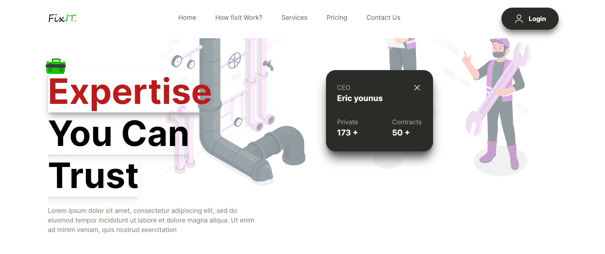

# Plumbing Services Website Template

A modern and responsive website template for plumbing services, built with Next.js, Tailwind CSS, and TypeScript.

## Table of Contents

- [Features](#features)
- [Prerequisites](#prerequisites)
- [Installation](#installation)
- [Usage](#usage)
- [Customization](#customization)
- [Contributing](#contributing)
- [License](#license)

## Features

- **Next.js:** Server-side rendering, improved performance.
- **Tailwind CSS:** Utility-first CSS framework for styling.
- **TypeScript:** Static typing for better code quality.
- **Responsive Design:** Ensures a seamless experience across devices.

## Prerequisites

Before you begin, ensure you have the following installed on your machine:

- [Node.js](https://nodejs.org/)
- [npm](https://www.npmjs.com/)

## Installation

1. Clone the repository:

   ```bash
   git clone https://github.com/uakk101/fixit.git
   ```
